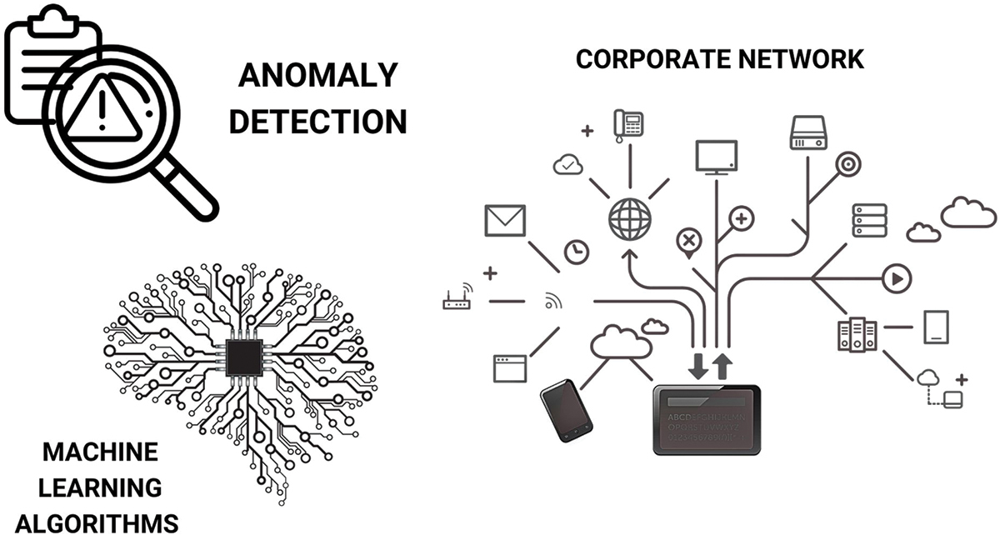

# Machine-Learning
Machine Learning-Based Spam and Network Anomaly Detection for Securing Communication Channels in Healthcare Systems

<h2>Requirements</h2>

    pandas
    numpy
    scikit-fuzzy (skfuzzy)
    scikit-learn
    matplotlib
    plotly
    ydata_profiling
    seaborn
    scipy
<h1>Usage</h1>
To replicate the study and run tSpam and Network Anomaly Detection  system:
1. Clone the repository: `git clone https://github.com/your-username/your-repo.git` 
2. Install the required dependencies: `pip install -r requirements.txt`
3. Navigate to the project directory: `cd path/to/project`
4. Run the fuzzy logic system: `python main.py`
